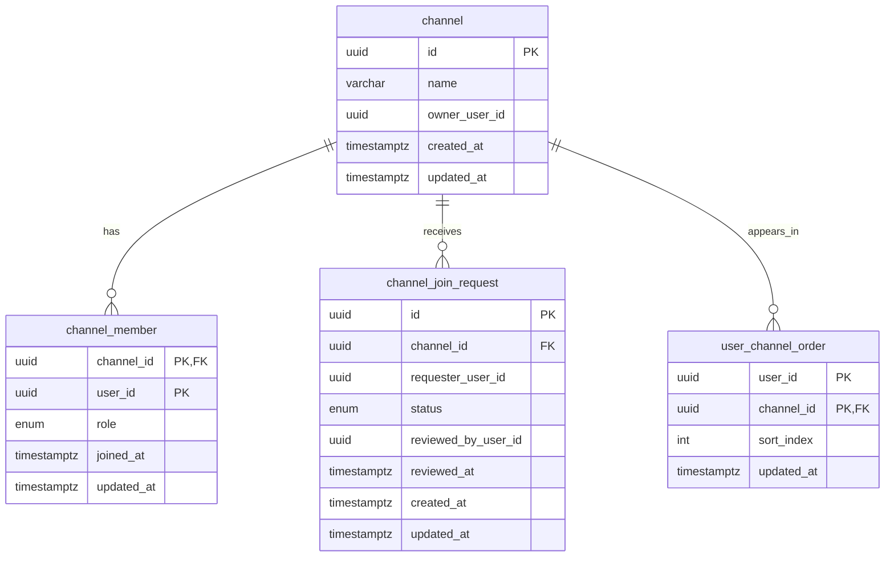

Tech-Stack: specs/00-tech-stack.md

# Data Model: Channel Governance

**Spec**: [spec.md](./spec.md)  
**Plan**: [plan.md](./plan.md)  
**Date**: 2026-03-04

## Overview

채널 거버넌스 기능을 위한 영속 모델 정의 문서다.

- 역할: `owner | manager | member`
- 가입요청 상태: `pending | approved | rejected`
- 핵심 무결성:
  - 채널당 owner는 정확히 1명
  - `channel.owner_user_id`와 owner membership 일치
  - 동일 사용자의 동일 채널 `pending` 요청 중복 금지

## Tables

## `channel`

- 목적: 채널 메타 정보 및 소유자 보관
- 컬럼:
  - `id` UUID PK
  - `name` varchar(100) not null
  - `owner_user_id` UUID not null
  - `created_at` timestamptz not null default now()
  - `updated_at` timestamptz not null default now()

- 인덱스:
  - `idx_channel_owner_user_id (owner_user_id)`

- 제약:
  - `chk_channel_name_non_empty` (`char_length(trim(name)) > 0`)

## `channel_member`

- 목적: 채널별 멤버십/역할
- 컬럼:
  - `channel_id` UUID not null
  - `user_id` UUID not null
  - `role` channel_role not null (`owner|manager|member`)
  - `joined_at` timestamptz not null default now()
  - `updated_at` timestamptz not null default now()

- PK:
  - `(channel_id, user_id)`

- FK:
  - `channel_id -> channel.id ON DELETE CASCADE`

- 인덱스:
  - `idx_channel_member_user_id (user_id)`
  - `idx_channel_member_channel_role (channel_id, role)`

- 제약:
  - 채널별 owner 단일성: partial unique index  
    `uq_channel_single_owner ON channel_member(channel_id) WHERE role='owner'`

## `channel_join_request`

- 목적: 가입 신청/승인 이력
- 컬럼:
  - `id` UUID PK
  - `channel_id` UUID not null
  - `requester_user_id` UUID not null
  - `status` channel_join_request_status not null (`pending|approved|rejected`)
  - `reviewed_by_user_id` UUID null
  - `reviewed_at` timestamptz null
  - `created_at` timestamptz not null default now()
  - `updated_at` timestamptz not null default now()

- FK:
  - `channel_id -> channel.id ON DELETE CASCADE`

- 인덱스:
  - `idx_join_request_channel_status_created (channel_id, status, created_at desc)`
  - `idx_join_request_requester_created (requester_user_id, created_at desc)`

- 제약:
  - 중복 pending 방지 partial unique index  
    `uq_join_request_pending ON channel_join_request(channel_id, requester_user_id) WHERE status='pending'`
  - 상태 무결성 체크:
    - `status='pending'` -> `reviewed_by_user_id IS NULL AND reviewed_at IS NULL`
    - `status IN ('approved','rejected')` -> `reviewed_by_user_id IS NOT NULL AND reviewed_at IS NOT NULL`

## `user_channel_order`

- 목적: 사용자 개인 채널 리스트 정렬 저장
- 컬럼:
  - `user_id` UUID not null
  - `channel_id` UUID not null
  - `sort_index` int not null
  - `updated_at` timestamptz not null default now()

- PK:
  - `(user_id, channel_id)`

- FK:
  - `channel_id -> channel.id ON DELETE CASCADE`

- 인덱스:
  - `idx_user_channel_order_user_sort (user_id, sort_index)`

- 제약:
  - `uq_user_channel_order_user_sort UNIQUE(user_id, sort_index)`
  - `chk_user_channel_order_sort_non_negative (sort_index >= 0)`

정렬 저장 정책:
- owner reorder와 personal reorder 모두 `user_channel_order`를 사용한다.
- 차이는 저장 대상 필터만 다르다.
  - owner reorder: `user_id=owner` + owner가 소유한 channel 집합
  - personal reorder: `user_id=actor` + actor가 가입한 channel 집합

## Enums

- `channel_role`
  - `owner`
  - `manager`
  - `member`

- `channel_join_request_status`
  - `pending`
  - `approved`
  - `rejected`

## Derived Rules (Service-Level + DB-Level)

1. 채널 생성 시:
  - `channel` 1행 생성
  - 동일 트랜잭션에서 `channel_member(role=owner)` 생성
2. 소유권 이전 시:
  - 기존 owner -> `manager`(기본 정책) 또는 `member`
  - 새 owner row -> `owner`
  - `channel.owner_user_id` 동시 갱신
3. 탈퇴:
  - owner는 소유권 이전 전 탈퇴 불가
4. 승인:
  - `pending -> approved` 전이 시 멤버십 upsert
5. 거절:
  - `pending -> rejected` 전이만 허용

## Suggested Query Patterns

1. 내가 참여한 채널 목록:
  - `channel_member` by `user_id` + `channel`
  - 개인 정렬은 `user_channel_order` left join
2. 채널 가입 요청 목록:
  - `channel_join_request` by `channel_id`, `status='pending'`, created desc
3. owner/manager 권한 검증:
  - `channel_member` where `(channel_id, user_id)` then role compare

## Mermaid ERD

## Migration Notes

1. enum 생성: `channel_role`, `channel_join_request_status`
2. 테이블 생성 순서:
  - `channel`
  - `channel_member`
  - `channel_join_request`
  - `user_channel_order`
3. partial unique index/체크 제약 추가
4. 롤백 시 역순 삭제
