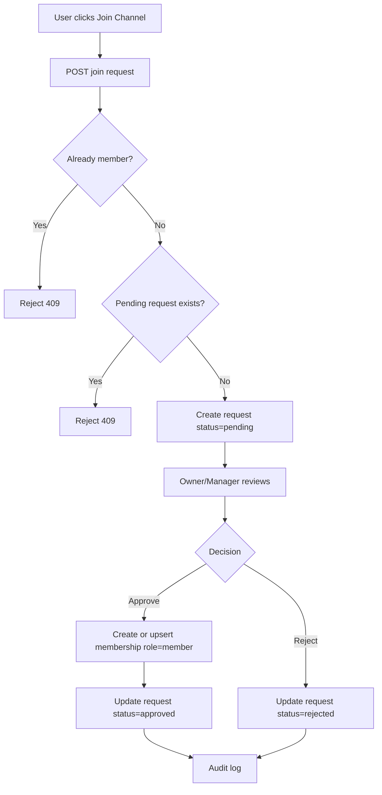
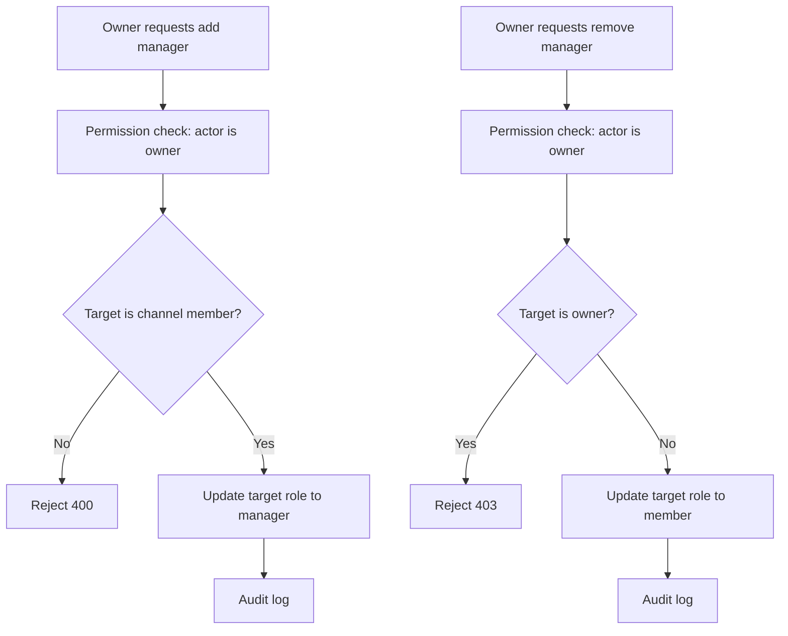
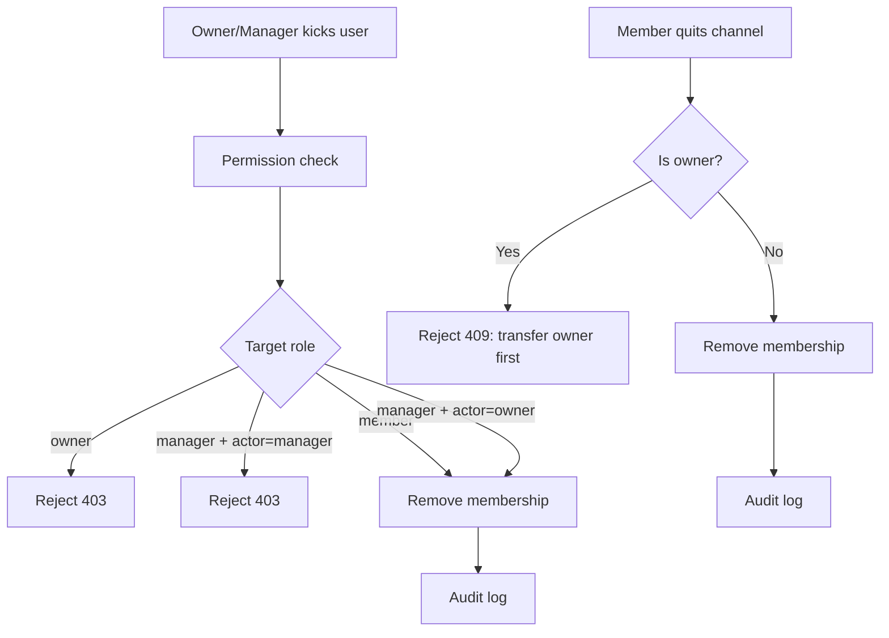
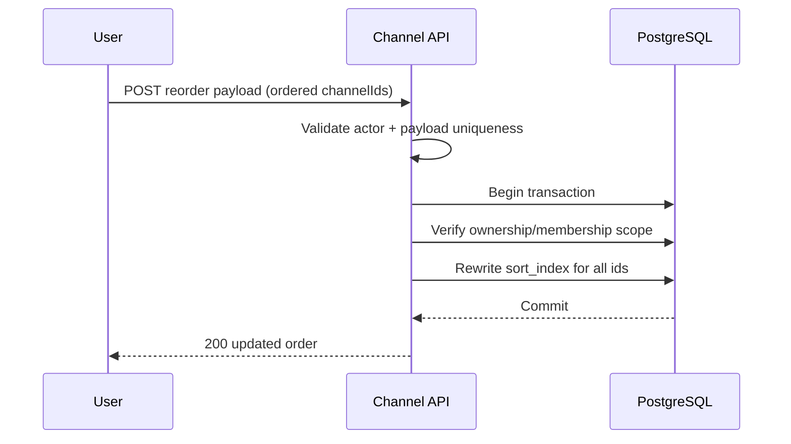

Tech-Stack: specs/00-tech-stack.md

# Feature Specification: Channel Governance

**Feature Branch**: `feature/channel-governance`  
**Created**: 2026-03-04  
**Status**: Draft  
**Input**: "channel api + join approval + owner/manager/member roles + reorder + quit"

## Summary

채널 생성/참여/권한/정렬을 포함한 채널 거버넌스 기능을 정의한다.

- 유저는 채널을 생성할 수 있다.
- 채널 생성자는 소유자(owner)다.
- 소유자는 매니저(manager)를 지정/해제할 수 있다.
- 매니저/소유자는 가입 요청을 승인/거절할 수 있다.
- 유저는 자동 가입되지 않고 승인 기반으로 가입된다.
- 멤버는 채널을 자발적으로 탈퇴할 수 있다.
- 소유자/유저는 각각 목적에 맞는 드래그앤드롭 정렬을 수행할 수 있다.

## Scope

### In Scope

- Channel CRUD 중 생성/조회/정렬/탈퇴/강퇴/가입요청/승인관리
- 역할: owner, manager, member
- 가입 승인 워크플로우
- 개인 채널 리스트 정렬
- 소유자 채널 관리 정렬

### Out of Scope

- 실시간 채팅/메시징
- 채널 아바타/배너 미디어 업로드
- 외부 공개 링크 기반 자동 가입

참고: 본 스펙의 채널은 거버넌스(멤버십/권한/정렬) 단위이며, 메시징 기능은 후속 스펙에서 동일 멤버십 모델을 재사용해 확장한다.

## Roles & Permissions

- `owner`
  - 매니저 추가/제거
  - 가입 요청 승인/거절
  - 멤버/매니저 강퇴
  - 채널 설정 변경
- `manager`
  - 가입 요청 승인/거절
  - 일반 멤버 강퇴
  - 소유자/다른 매니저 권한 변경 불가
- `member`
  - 채널 참여 상태 유지
  - 채널 탈퇴 가능

## Functional Requirements

- **FR-CH-001**: 사용자는 채널을 생성할 수 있어야 한다.
- **FR-CH-002**: 사용자 1인은 최대 10개의 채널을 생성할 수 있어야 한다.
- **FR-CH-003**: 채널 생성자는 자동으로 owner가 되어야 한다.
- **FR-CH-004**: owner는 manager를 추가/제거할 수 있어야 한다.
- **FR-CH-005**: 사용자는 채널 가입 요청을 생성할 수 있어야 한다.
- **FR-CH-006**: 가입 요청은 owner 또는 manager 승인 전까지 `pending` 상태여야 한다.
- **FR-CH-007**: owner/manager는 가입 요청을 승인 또는 거절할 수 있어야 한다.
- **FR-CH-008**: 사용자는 승인 전 채널 멤버십을 획득하면 안 된다.
- **FR-CH-009**: owner/manager는 멤버를 강퇴할 수 있어야 한다.
- **FR-CH-010**: 사용자는 자신이 참여 중인 채널을 자발적으로 탈퇴할 수 있어야 한다.
- **FR-CH-011**: owner는 자신의 채널 관리 목록 순서를 드래그앤드롭으로 변경할 수 있어야 한다.
- **FR-CH-012**: 사용자는 자신의 채널 리스트 순서를 드래그앤드롭으로 변경할 수 있어야 한다.
- **FR-CH-013**: 사용자당 가입 가능한 채널 수 상한을 서버에서 강제해야 하며, 기본값은 `200`이다.
- **FR-CH-014**: 가입 요청/승인/거절/강퇴/권한변경은 감사 로그를 남겨야 한다.
- **FR-CH-015**: owner는 다른 멤버에게 소유권을 이전할 수 있어야 하며, 이전 후 기존 owner는 manager 또는 member로 강등될 수 있어야 한다.
- **FR-CH-016**: manager는 `member`만 강퇴할 수 있고, owner는 `manager`와 `member`를 강퇴할 수 있어야 한다.

## Non-Functional Requirements

- **NFR-CH-001**: 권한 체크는 모든 변경 API에서 서버 측으로 강제되어야 한다.
- **NFR-CH-002**: 정렬 순서 업데이트는 idempotent하게 처리되어야 한다.
- **NFR-CH-003**: 동일 가입 요청 중복 생성은 방지되어야 한다.
- **NFR-CH-004**: 승인/강퇴 관련 API는 동시성 충돌 시 일관된 결과를 반환해야 한다.
- **NFR-CH-005**: 기존 인증/세션/CSRF 정책과 충돌하지 않아야 한다.

## Data Model (Conceptual)

- `channel`
  - id, owner_user_id, name, created_at, updated_at
- `channel_member`
  - channel_id, user_id, role(owner|manager|member), joined_at
- `channel_join_request`
  - id, channel_id, requester_user_id, status(pending|approved|rejected), reviewed_by, reviewed_at, created_at
- `user_channel_order`
  - user_id, channel_id, sort_index

무결성 규칙:
- `channel.owner_user_id`는 항상 동일 채널의 `channel_member.role=owner` 행과 일치해야 한다.

## API Surface (Conceptual)

- `POST /api/v1/channels`
- `GET /api/v1/channels`
- `POST /api/v1/channels/:channelId/join-requests`
- `GET /api/v1/channels/:channelId/join-requests`
- `POST /api/v1/channels/:channelId/join-requests/:requestId/approve`
- `POST /api/v1/channels/:channelId/join-requests/:requestId/reject`
- `POST /api/v1/channels/:channelId/managers`
- `DELETE /api/v1/channels/:channelId/managers/:userId`
- `POST /api/v1/channels/:channelId/kick`
- `POST /api/v1/channels/:channelId/quit`
- `POST /api/v1/channels/:channelId/transfer-ownership`
- `POST /api/v1/channels/reorder-owned`
- `POST /api/v1/channels/reorder-my-list`

## Workflows (Mermaid)

### Join Request Approval Flow

### Role Management Flow

### Member Kick / Quit Flow

### Reorder Flow (Owner / Personal)

## Edge Cases & Rules

- owner는 자신의 owner 권한을 제거할 수 없다.
- owner는 소유권 이전 없이 채널을 탈퇴할 수 없다.
- manager는 owner를 강퇴할 수 없다.
- manager는 다른 manager를 강퇴할 수 없다.
- 이미 멤버인 사용자는 가입 요청을 생성할 수 없다.
- `pending` 요청이 이미 있으면 새 요청 생성은 거부한다.

## Policy Note: Join Limit Decision

본 기능에서는 사용자당 가입 채널 수 상한을 `200`으로 확정한다(FR-CH-013).

- 이유:
  - 목록/검색/권한 조회 성능 보호
  - 악의적 대량 가입 시도 완화
  - 모바일 UI 사용성 유지
  - 운영 비용 예측 가능성 확보

향후 제품 정책 변경으로 무제한이 필요하면, rate limit + 페이지네이션 + 배치 조회 최적화를 선행한 뒤 스펙을 갱신한다.

## Success Criteria

- **SC-CH-001**: 사용자당 채널 생성 10개 제한이 서버에서 강제된다.
- **SC-CH-002**: 승인 전에는 채널 접근 권한이 부여되지 않는다.
- **SC-CH-003**: owner/manager/member 권한 경계가 API에서 일관되게 적용된다.
- **SC-CH-004**: DnD 정렬 후 새 순서가 재접속 후에도 유지된다.
- **SC-CH-005**: 강퇴/탈퇴/승인/거절 이벤트가 감사 로그에 남는다.
