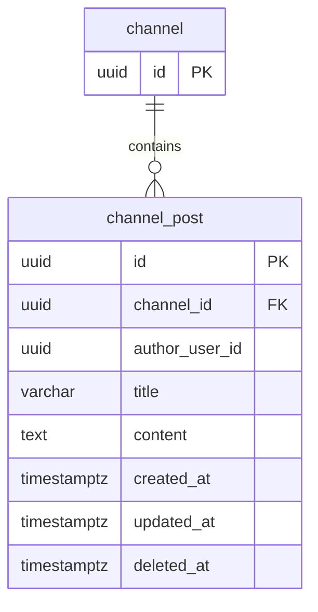

Tech-Stack: specs/00-tech-stack.md

# Data Model: Channel Posts

**Spec**: [spec.md](./spec.md)  
**Plan**: [plan.md](./plan.md)  
**Date**: 2026-03-04

## Overview

채널 게시글 기능의 영속 모델 정의 문서다.

- 채널 멤버십(`channel_member`) 권한을 재사용한다.
- 게시글은 soft delete 정책을 사용한다.
- 목록 조회는 cursor pagination을 위해 정렬 인덱스를 둔다.

## Tables

## `channel_post`

- 목적: 채널 내 공지/정보 게시글 저장
- 컬럼:
  - `id` UUID PK
  - `channel_id` UUID not null
  - `author_user_id` UUID not null
  - `title` varchar(120) not null
  - `content` text not null
  - `created_at` timestamptz not null default now()
  - `updated_at` timestamptz not null default now()
  - `deleted_at` timestamptz null

- FK:
  - `channel_id -> channel.id ON DELETE CASCADE`

- 인덱스:
  - `idx_channel_post_channel_created_id (channel_id, created_at desc, id desc)`  
    목록 + cursor pagination용
  - `idx_channel_post_author_created (author_user_id, created_at desc)`  
    운영 분석용
  - `idx_channel_post_not_deleted (channel_id, deleted_at)`  
    soft delete 제외 조회 보조

- 제약:
  - `chk_channel_post_title_non_empty` (`char_length(trim(title)) > 0`)
  - `chk_channel_post_content_non_empty` (`char_length(trim(content)) > 0`)

## Derived Rules

1. 조회(list/detail):
  - `deleted_at IS NULL`인 게시글만 반환
2. 수정(update):
  - `ifUpdatedAt`과 현재 `updated_at`이 일치할 때만 성공(낙관적 잠금)
3. 삭제(delete):
  - hard delete 금지
  - `deleted_at`, `updated_at`를 현재 시각으로 업데이트

## Query Patterns

1. 목록 조회:
  - 조건: `channel_id`, `deleted_at IS NULL`
  - 정렬: `created_at DESC, id DESC`
  - cursor: 마지막 행의 `(created_at, id)` 기준 다음 페이지 조회
2. 상세 조회:
  - 조건: `id`, `channel_id`, `deleted_at IS NULL`
3. 수정/삭제:
  - 조건: `id`, `channel_id`, `deleted_at IS NULL`

## Mermaid ERD

## Migration Notes

1. `channel_post` 테이블 생성
2. FK + 인덱스 + 체크 제약 추가
3. 롤백 시 인덱스 제거 후 테이블 삭제
