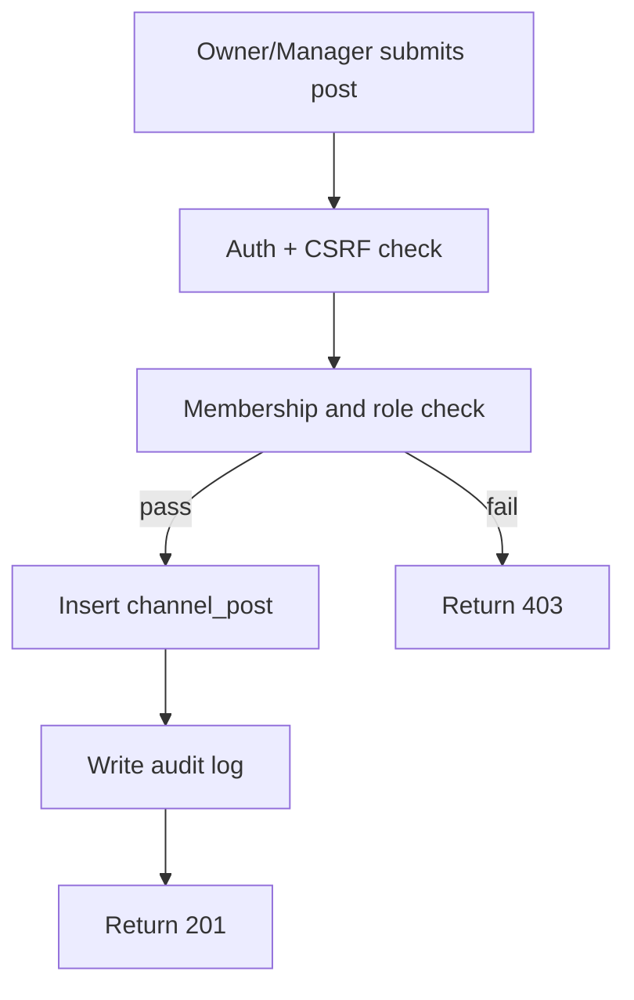
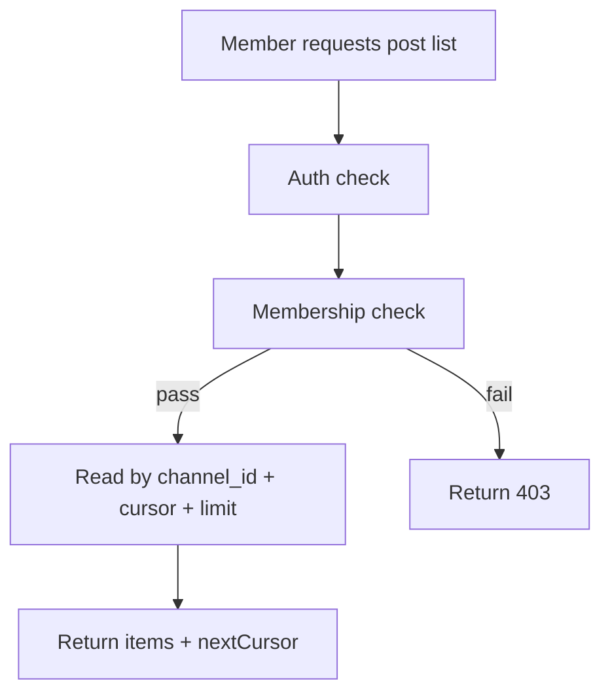
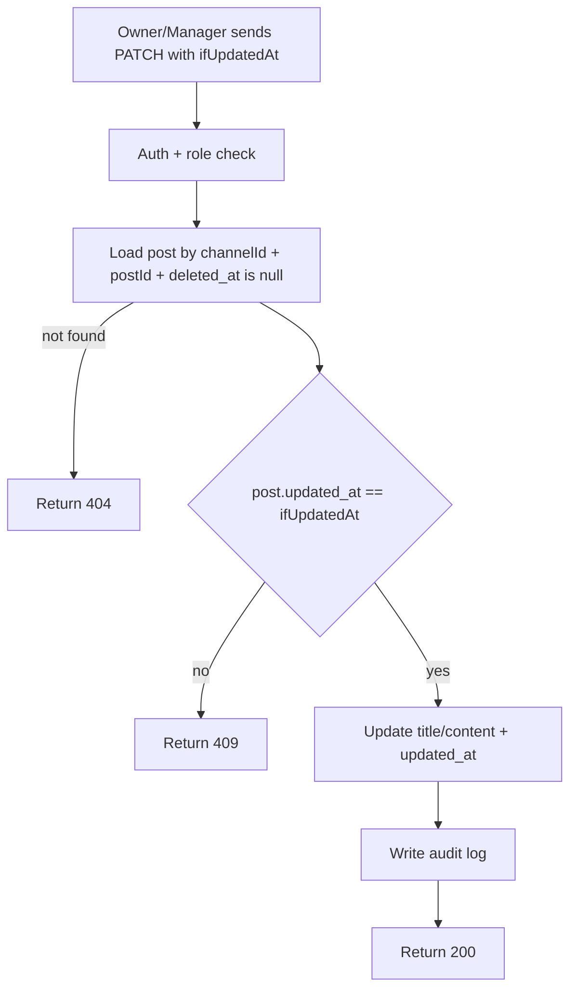

Tech-Stack: specs/00-tech-stack.md

# Feature Specification: Channel Posts

**Feature Branch**: `feature/channel-posts`  
**Created**: 2026-03-04  
**Status**: Draft  
**Input**: "channel should have post for share info with users"

## Summary

채널 내 공지/정보 공유를 위한 게시글 기능을 추가한다.

- 채널 멤버는 게시글을 조회할 수 있다.
- owner/manager는 게시글을 생성/수정/삭제할 수 있다.
- 게시글은 채널 멤버십 권한을 기준으로 접근 제어한다.

## Scope

### In Scope

- 채널 게시글 생성/조회/수정/삭제
- 채널 단위 게시글 목록 조회(페이지네이션)
- 채널 역할(owner/manager/member) 기반 권한 강제

### Out of Scope

- 실시간 채팅/메시징
- 댓글/대댓글
- 파일 업로드
- 게시글 고정(pin)

## Roles & Permissions

- `owner` / `manager`
  - 게시글 생성
  - 채널 내 모든 게시글 수정/삭제 가능(운영 공지 관리 목적)
- `member`
  - 게시글 조회만 가능

## Functional Requirements

- **FR-CP-001**: owner/manager는 채널 게시글을 생성할 수 있어야 한다.
- **FR-CP-002**: 채널 멤버는 게시글 목록/상세를 조회할 수 있어야 한다.
- **FR-CP-003**: owner/manager는 게시글을 수정할 수 있어야 한다.
- **FR-CP-004**: owner/manager는 게시글을 삭제(soft delete)할 수 있어야 한다.
- **FR-CP-005**: 비멤버는 게시글 목록/상세를 조회할 수 없어야 한다.
- **FR-CP-006**: 게시글 목록은 최신순 정렬과 커서 기반 페이지네이션을 제공해야 한다.
- **FR-CP-007**: 생성/수정/삭제 이벤트는 감사 로그를 남겨야 한다.
- **FR-CP-008**: 삭제된 게시글은 기본 목록/상세 응답에서 제외되어야 한다.
- **FR-CP-009**: 게시글 수정은 `updatedAt` 기반 낙관적 동시성 제어를 지원해야 한다.

## Non-Functional Requirements

- **NFR-CP-001**: 모든 변경 API는 서버 측 권한 체크를 강제해야 한다.
- **NFR-CP-002**: 게시글 삭제는 감사/복구 가능성을 위해 soft delete를 기본으로 한다.
- **NFR-CP-003**: 목록 조회는 인덱스를 통해 페이지 단위 응답이 200ms 내(기준 데이터셋) 동작해야 한다.
- **NFR-CP-004**: 기존 인증/세션/CSRF 정책과 정합성을 유지해야 한다.

## Data Model (Conceptual)

- `channel_post`
  - id, channel_id, author_user_id, title, content, created_at, updated_at, deleted_at(nullable)

Schema SSOT:
- [data-model.md](./data-model.md)

## API Surface (Conceptual)

- `POST /api/v1/channels/:channelId/posts`
- `GET /api/v1/channels/:channelId/posts?cursor=&limit=`
- `GET /api/v1/channels/:channelId/posts/:postId`
- `PATCH /api/v1/channels/:channelId/posts/:postId`
- `DELETE /api/v1/channels/:channelId/posts/:postId`

### API Notes

- create
  - body: `title(1..120)`, `content(1..5000)`
- list
  - query: `limit(1..50, default 20)`, `cursor(optional)`
  - response: `items[]`, `nextCursor(nullable)`
- update
  - body: `title?`, `content?`, `ifUpdatedAt`(required, ISO datetime)
- delete
  - soft delete only (`deleted_at` set)
  - success status: `200`

### Error Behavior (Expected)

- `401`: 인증 없음
- `403`: 채널 멤버가 아니거나 변경 권한 없음
- `404`: 채널/게시글 리소스 없음 또는 soft delete 상태
- `409`: `ifUpdatedAt` 불일치(동시 수정 충돌)
- `400`: 요청 본문/쿼리 검증 실패

## Workflows (Mermaid)

### Create Post

### List Posts

### Update Post (Optimistic Concurrency)

## Success Criteria

- **SC-CP-001**: owner/manager만 게시글 변경 API에 성공한다.
- **SC-CP-002**: member는 조회 API에 성공하고, 비멤버는 실패한다.
- **SC-CP-003**: 게시글 목록 페이지네이션이 정상 동작한다.
- **SC-CP-004**: 생성/수정/삭제 감사 로그가 남는다.
- **SC-CP-005**: soft delete된 게시글은 조회 결과에서 제외된다.
